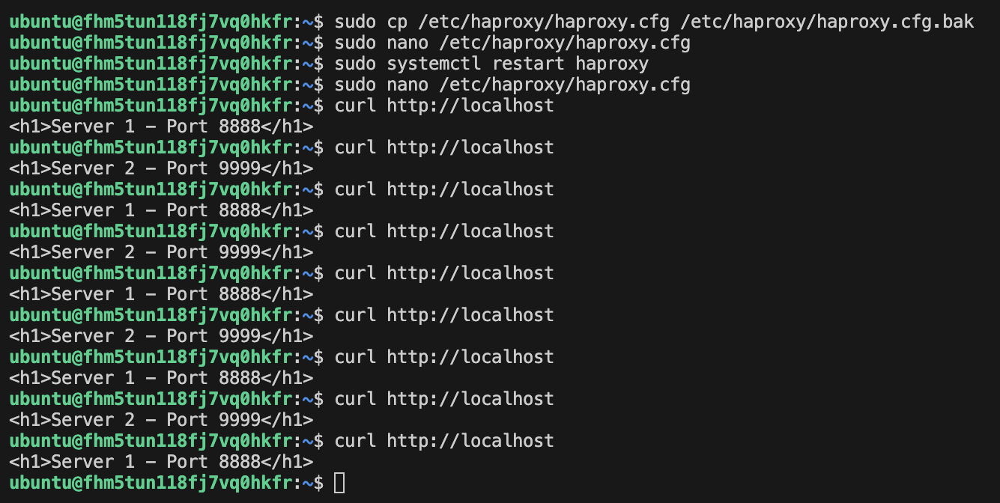
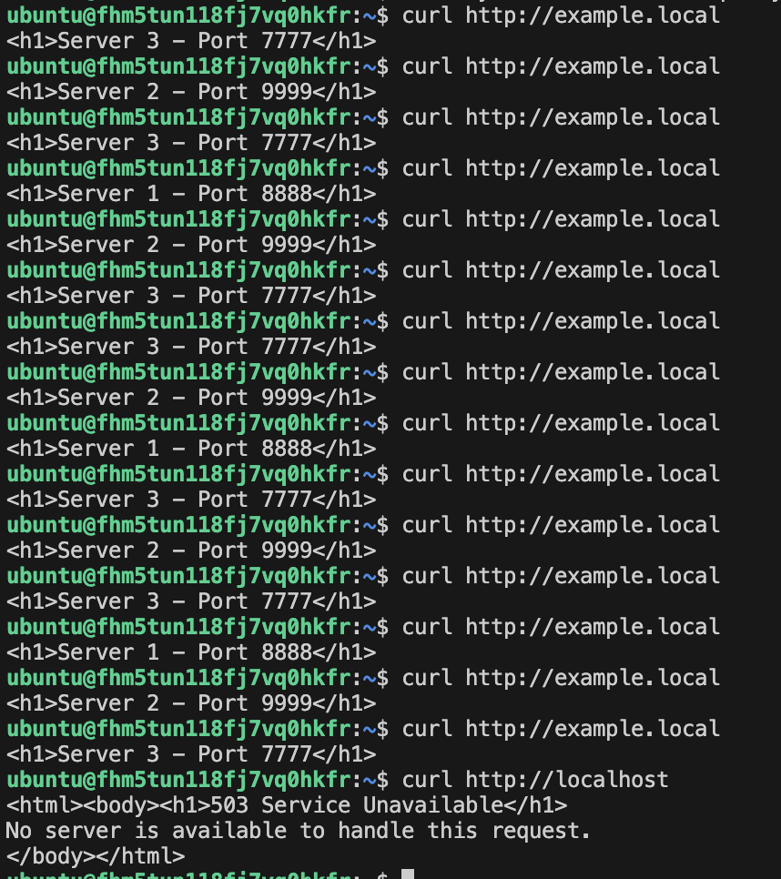

# Домашнее задание: Кластеризация и балансировка нагрузки

**Студент:** Гридин Владимир

---

## Задание 1: Round-robin на 4 уровне

## Задание 2: Weighted Round Robin на 7 уровне

- Домен: `example.local`
- `curl http://example.local` — чаще Server 3, затем 2, затем 1
- `curl http://localhost` — 503 ошибка

---